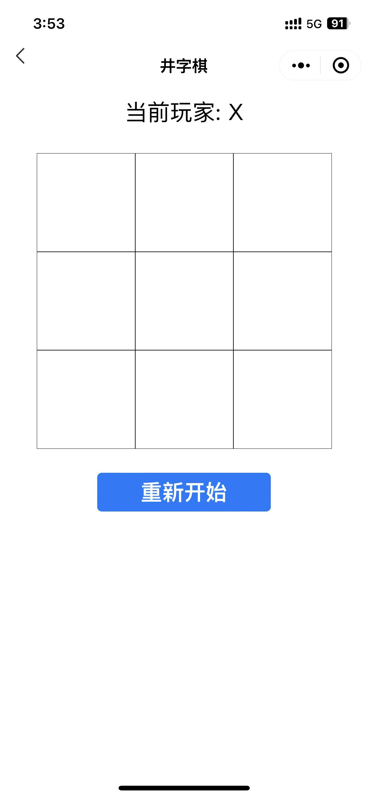

# Tools微信小程序

## 项目介绍

Tools微信小程序是一款基于微信小程序开发的工具箱，主要用于开发者和IT工作者。

## 项目特点

- 基于微信小程序开发
- 基于JavaScript开发
- 基于Node.js开发
- 后端基于flask开发
  
## 工具列表

- [x] 井字棋（仅支持双人）

## 开发工具
- 微信开发者工具1.06.2308310
- 渲染引擎：skyline

## 使用方法

- 克隆本项目
- 在微信开发工具中导入项目
- 选择项目目录

## 项目演示
| 项目 | 扫码体验 | 项目截图 |
|------|------|------|
|   井字棋 | |   |
|   todo | |  |

