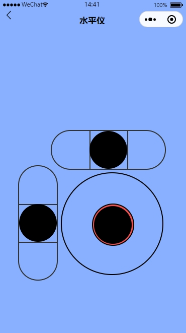
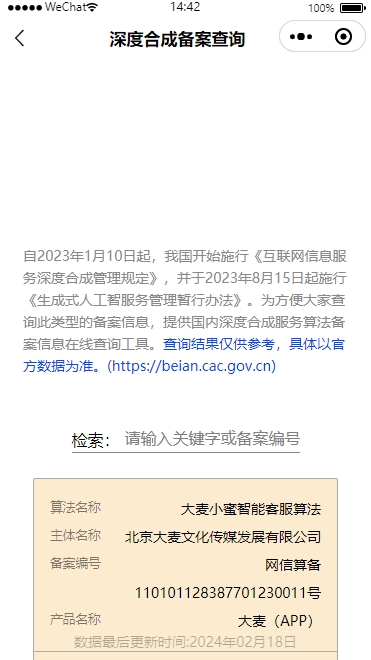

# Tools微信小程序

## 项目介绍

Tools微信小程序是一款基于微信小程序开发的工具箱，主要用于开发者和IT工作者。

## 项目特点

- 基于微信小程序开发
- 基于JavaScript开发
- 基于Node.js开发
- 后端基于flask开发
  
## 工具列表

- [x] 井字棋（仅支持单机双人）
- [x] 每日一图（数据来源bing）
- [x] 水平仪
- [x] 深度合成服务算法备案查询

## 开发工具
- 微信开发者工具1.06.2308310
- 渲染引擎：skyline

## 使用方法

- 克隆本项目
- 在微信开发工具中导入项目
- 选择项目目录

## 后端服务方法

- 克隆项目

- 基于docker环境

  1、构建镜像

  ```
  docker build -t api-flask:v1 .
  ```

  2、运行

  ```
  docker run -it -d -p 6060:6060 api-flask:v1
  ```

  3、创建auth令牌（采用本地模式，token时间永久，可自行调整代码），如果接口不需要令牌认证，取消认证即可@token_required

  ```
  curl -X POST -H "Content-Type: application/json" -d '{"username": "flask-api", "password": "M@gor^5EIUwv!83L"}' http://localhost:6060/auth
  ```

  5、nginx转发代理，ssl采用默认配置，可自行调整

  ```
  server {
          listen       443 ssl;
          server_name  api.xxxxx.com;
          ssl_certificate      /etc/nginx/api.xxxxx.com.pem;
          ssl_certificate_key  /etc/nginx/api.xxxxx.com.key;
          ssl_session_cache    shared:SSL:1m;
          ssl_session_timeout  5m;
          ssl_ciphers  HIGH:!aNULL:!MD5;
          ssl_prefer_server_ciphers  on;
          client_max_body_size 20M;
  
          location / {
          	proxy_pass http://localhost:6060;
          	proxy_set_header Host $http_host;
          	proxy_set_header X-Real-IP $remote_addr;
          	proxy_set_header X-Forwarded-For $proxy_add_x_forwarded_for;
          }
  }
  ```

  6、修改微信小程序请求接口地址以及请求认证token

  

## 项目体验

**搜索相应项目名称进行体验**


## 项目截图

### 井字棋


### 每日一图（壁纸）


### 水平仪



### 深度合成服务算法备案查询



